![[CRAFT🔨] Anime Card Farm — teardown](images/001-craft-anime-card-farm-teardown.jpg)

# [CRAFT🔨] Anime Card Farm — teardown

RNG-COLLECTOR

· Anime Card Factory ✔ · placeId 125039473548047

An anime-card gacha collector wearing a cozy "card factory" mask. You buy packs off a conveyor, wait out a timer, open a card, place it on your plot where it drips **$/sec**, then sell the box and buy a better pack. Underneath sits a deep whale engine: **41 rarity tiers**, finish-mutations, leveling to **50 (x3300 on value)**, rank and trait rolls, craft-evolution, a raid boss and an endless tower. Built from a **frame-by-frame pass over the whole capture** (284 screens) — first second to finale.

CCU

24,702

Visits

38.7M

This week

+8.3M

Favorites

1.19M

Rating

97.7%

Votes

61,303 up / 1,445 down

Live since

2026-05-09

Genre

All

#### Contents

1. 01 Classification — game atoms

2. 02 Passport & market

3. 03 Core loop: from the first second

4. 04 Packs, conveyor & the rarity ladder

5. 05 A card = 5 value multipliers

6. 06 Plaza — the activity hub

7. 07 The rolls: Rank & Trait

8. 08 Card Craft evolution

9. 09 Combat: Boss Raid & Tower

10. 10 Economy & prices

11. 11 Monetization

12. 12 HUD & menus

13. 13 Retention

14. 14 Badges & the social funnel

15. 15 SFX, VFX & ceremonies

16. 16 Clippable moments

17. 17 Updates × online (CCU)

18. 18 What to take

## 01 Classification — game atoms

What this game is at the mechanics level, not the storefront. Atoms, a signature formula, and the hidden machine-readable block QA validates.

**Verb**

**Pull & collect** (gacha) on top of **idle income**

**Theme**

Anime cards: a cozy "card factory" as the wrapper for gacha

**Core systems**

Gacha packs · idle $/s from cards on the plot · card leveling · rank & trait rolls · craft-evolution · boss raid · infinity tower

**Economy**

**Cash** (soft, from selling cards) · **Rank Gems** · **Trait Gems** · **Robux ⬡**

**Mask**

"ASMR card factory": buy a pack, hear it open — under it a whale gacha engine

**Archetype**

**RNG-COLLECTOR** — repeat random opens, retain results, improve odds/access

**Progression**

Collect finishes → level to 50 → roll rank → roll trait → craft-evolve. **No rebirth**

[RNG-COLLECTOR: buy→open→pull→place→sell]

+

container-gacha + passive-income + rng-roll + crafting + combat + upgrade-tree + offline-earnings + daily-rewards + social-multipliers + selling

|

{anime-card-gacha · evergreen · shared}

×

rarity-ladder

— idle storefront, whale math underneath

$

wall:pack-timer→offer:timer-skip

!

reveal-ceremony

## 02 Passport & market

A young but fast-growing game: in the week before capture visits jumped 8.3M (30.4M → 38.7M) while holding ~25k concurrent.

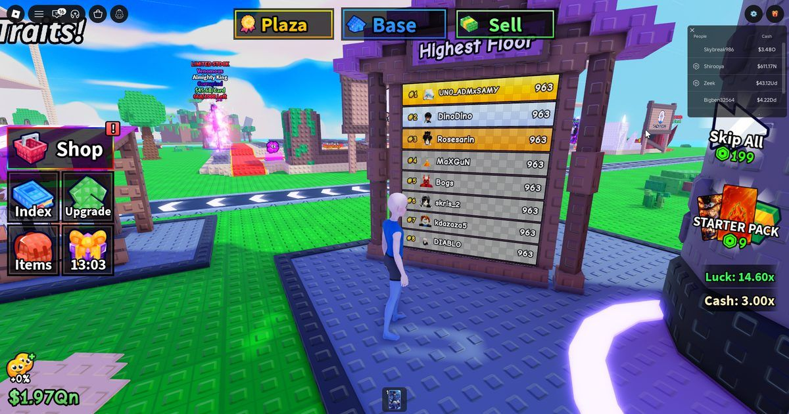

*Server boards: left is the Tower "Highest Floor" (the top 8 are all stuck at floor 963 — a soft cap); right is "People", a leaderboard ranked by Cash net worth (leader at $3.48O — octillion). The game publicly measures players in money.*

| Metric | Value (2026-08-07) | Note |

| --- | --- | --- |

| Concurrent (CCU) | 24,702 | was 25,697 a week earlier — holding |

| Visits | 38.7M | +8.3M in a week → active traffic/ads |

| Favorites | 1.19M | 1.04M a week earlier |

| Rating | 97.7% | 61,303 up / 1,445 down |

| Creator | Anime Card Factory ✔ | verified Group account |

| Age | since 2026-05-09 | updated 2026-08-05 — live update cadence |

| Genre | All | charts: top-trending #74, top-playing #59 |

The capture was recorded by player **CondrusJellyfish**; part of the endgame was not a solo grind but help from a VIP player (see the caveat in the Economy chapter). Every number below is confirmed on a captured frame.

## 03 Core loop: from the first second

The tutorial walks the whole loop in a minute. That is the skeleton of the game; everything else is a multiplier bolted onto it.

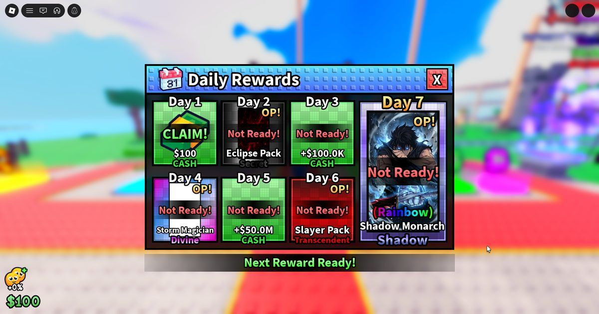

*The first screen after joining is Daily Rewards (7 days, 24h cooldown): D1 $100 → D2 Eclipse Pack (Secret) → … → D7 Shadow Monarch (Rainbow). The return hook lands before the tutorial even starts.*

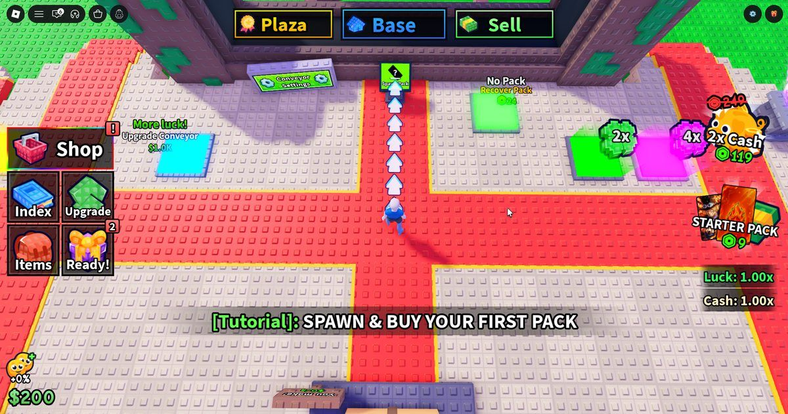

*Tutorial: "SPAWN & BUY YOUR FIRST PACK". Top nav Plaza / Base / Sell; left rail Shop · Index · Upgrade · Items; a spawn-pack pedestal, Conveyor Settings, and the first Robux pads (Starter ⬡9, 2x Cash ⬡119).*

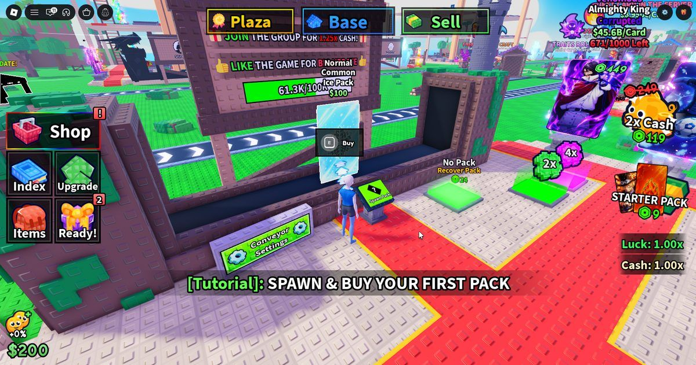

*Buying a pack at the podium: Ice Pack — Common — $100 ( E Buy). Billboards read "JOIN THE GROUP FOR 1.25x CASH!" and a like goal 61.3K/100K; a limited chase-card ticker scrolls up top.*

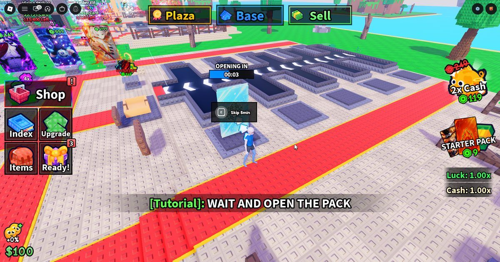

*The pack is placed on your plot and opens on a timer: "OPENING IN", ~5 min base, E Skip 5min. The timer grows with pack rarity — the game's core "time wall".*

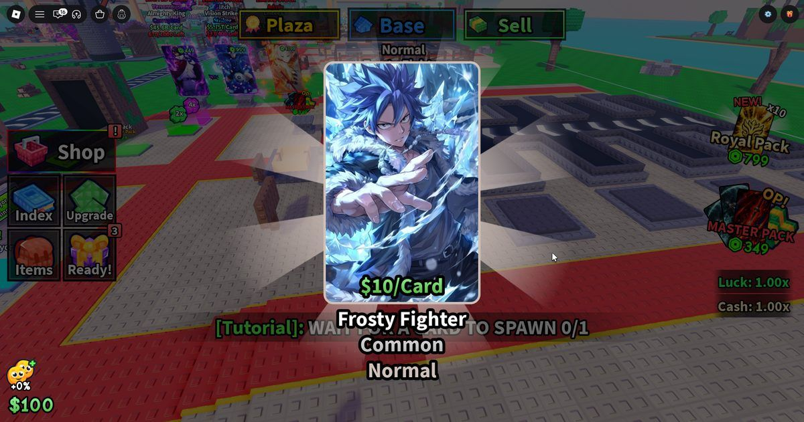

*First card: Frosty Fighter — Common — Normal — $10/Card. A card = name × rarity × finish × level; here everything is at base.*

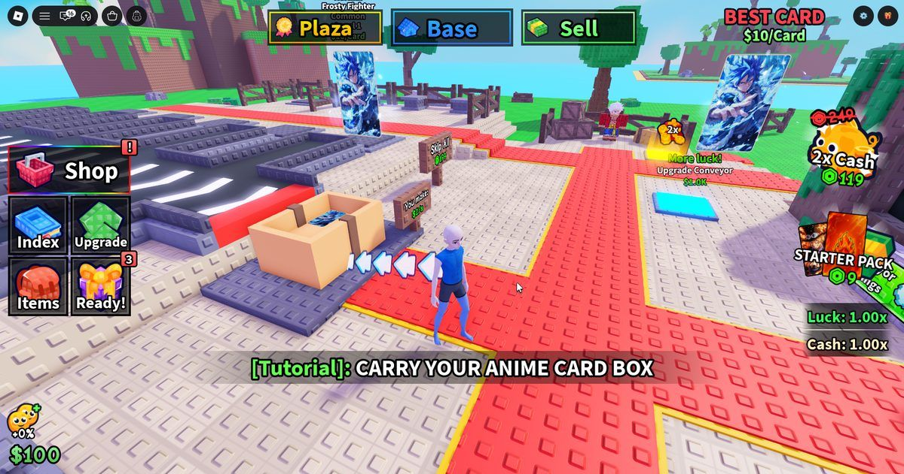

*You carry the card; on the plot it drips income — a "You make: $2/s" sign and a "BEST CARD $10/Card" tracker. The box gains value as cards accumulate.*

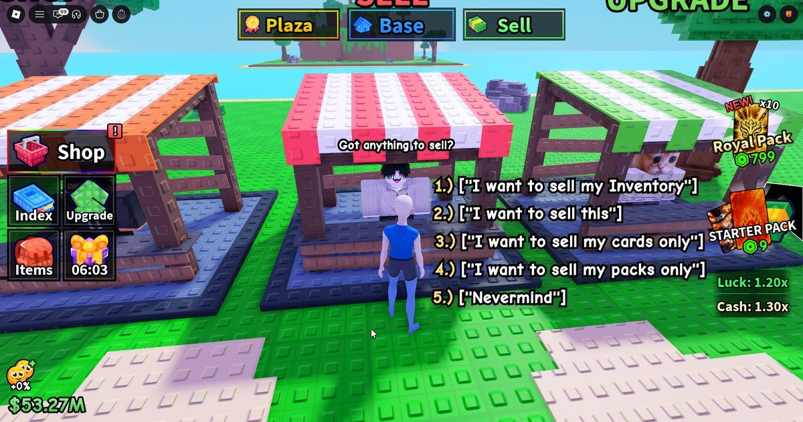

*Selling: the central SELL stall, NPC "Card Hunter". A 5-option dialog — sell inventory / this / cards only / packs only / nevermind. Payout is ~50% of value.*

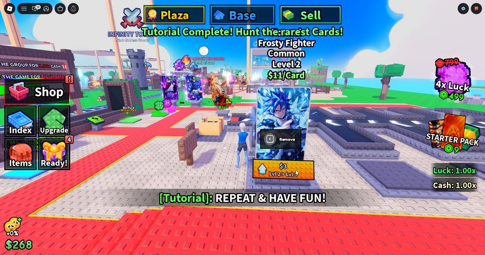

*Tutorial complete. Cards level up: Lvl 1→2 costs $2 (→ $11/Card), Lvl 2→3 costs $3. Both the level price and the $/Card gain scale with the card's rarity.*

The loop: **buy a pack → place it on the plot → wait the timer → a card drops → it drips $/sec → carry the box to Sell → reinvest into a pricier pack**. Everything else in the game is a multiplier or accelerator on those seven steps.

## 04 Packs, conveyor & the rarity ladder

The conveyor is the heart of the gacha. The Conveyor Settings panel reveals the whole rarity ladder and its economy at once.

*Conveyor Settings — the canonical rarity ladder. The Warn/Auto-Buy grid shows 9 base packs = 9 tiers: Ice(Common) · Sand(Uncommon) · Inferno(Rare) · Lightning(Epic) · Hightech(Legendary) · Dark(Mythic) · Eclipse(Secret) · Isekai(Divine) · Slayer(Transcendent).*

*Scrolling the same panel: the ladder does not stop at Transcendent. Premium tiers continue — Shadow(Monarch) · Emperor(Pirate King) · Demon · Manga · Celestial(Galaxy) · Heavenly(Heaven) · Corrupted(Void) · Striker(Soccer) · … · Chainsaw · Grail · Blaze · Devour. The full ladder is 41 rarity tiers, each its own pack and card pool.*

| Pack | Rarity | Price (Normal, Cash) |

| --- | --- | --- |

| Ice Pack | Common | $100 |

| Sand Pack | Uncommon | $1.0K |

| Inferno Pack | Rare | — |

| Lightning Pack | Epic | $1.0M |

| Hightech Pack | Legendary | $4.0M |

| Dark Pack | Mythic | $160.0M |

| Eclipse Pack | Secret | $500.0M |

| Isekai Pack | Divine | $60.0B |

| Slayer Pack | Transcendent | $100.0B |

Price **also scales with finish**: a plain Hightech = $4.0M, but a "Venomous"-mutated one = $12.0M — a mutated pack costs more and yields a pricier card. Any pack can also be **bought directly with Robux** (e.g. Dark Pack ⬡199) — a shortcut past the grind. Packs often spawn with a finish already (Golden/Sakura/Diamond/Venomous), which carries into the card they yield.

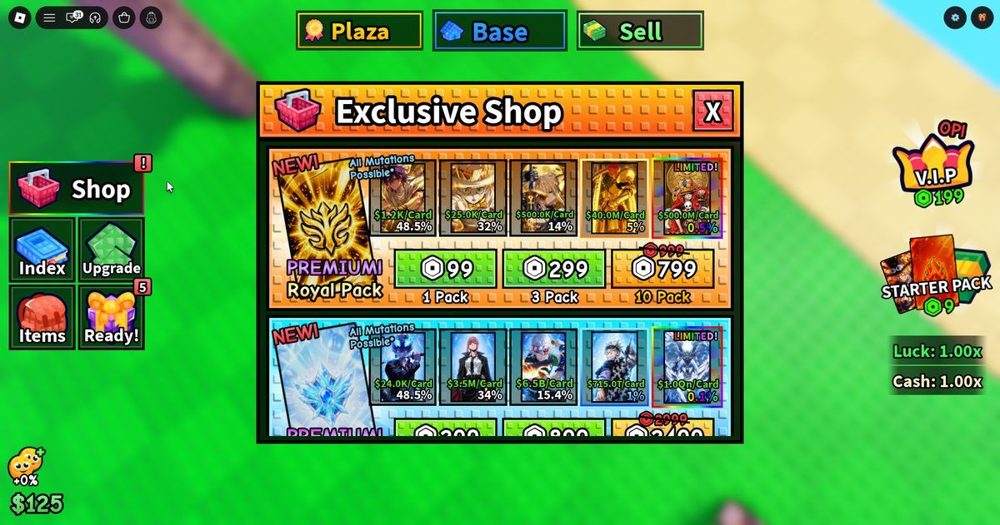

*Exclusive Shop — premium Robux packs with an odds table. Royal Pack (⬡99/299/799): $1.2K 48.5% · $25K 32% · $500K 14% · $40M 5% · LIMITED $500M 0.5%. The odds skeleton is ≈ 48.5 / 32 / 14 / 5 / 0.5%; a higher pack shifts the whole value curve up.*

## 05 A card = 5 value multipliers

A single card is the product of five independent multipliers. That is why two "identical" cards can differ thousandfold in $/Card.

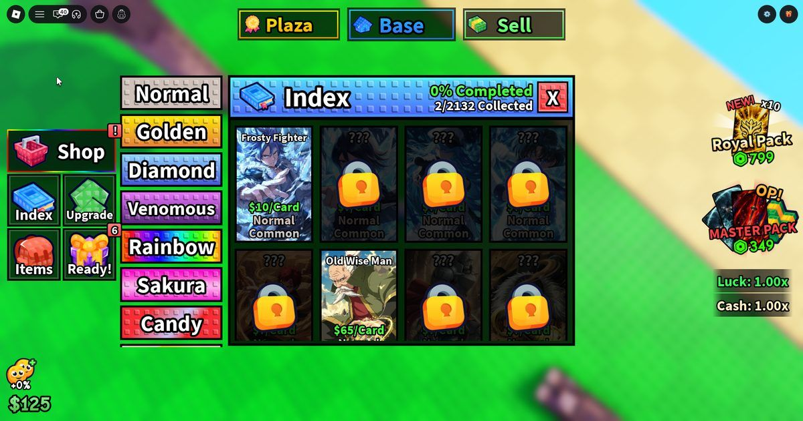

*Index — a catalog of 2,132 cards, organized by finish tabs (Normal · Golden · Diamond · Venomous · Rainbow · Sakura · Candy · …). A card's identity = Finish × Rarity × Name; unowned entries are hidden as "???".*

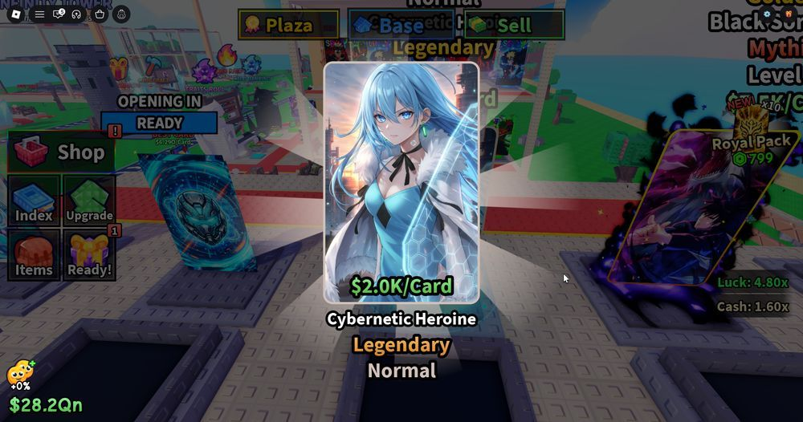

*The same Cybernetic Heroine (Legendary) in Normal finish — $2.0K/Card.*

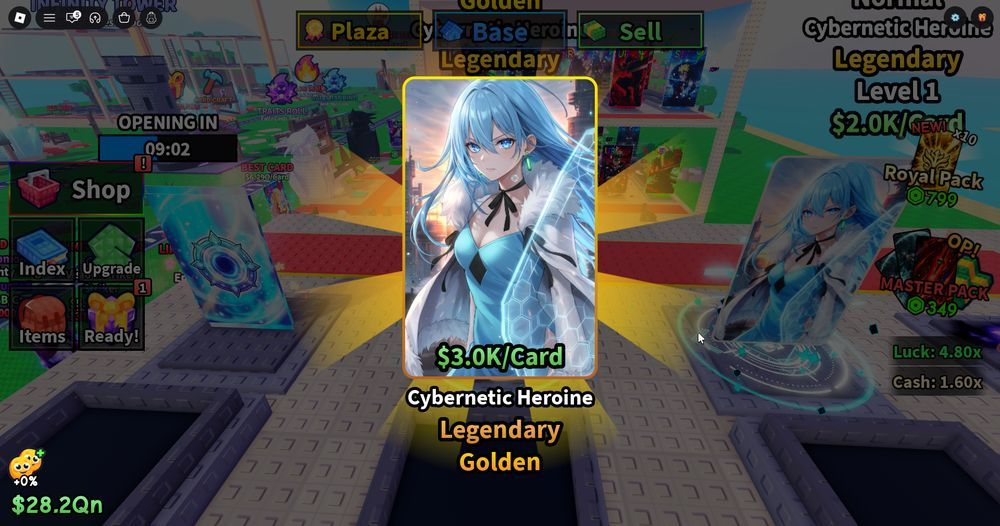

*The same card in Golden — $3.0K/Card (×1.5). Venomous is $6.0K (×3.0).*

That is a clean measurement of the **finish multiplier** on one card: Normal $2.0K → Golden $3.0K → Venomous $6.0K. On top of finish sits **level** — and it dominates:

| Multiplier | What it does | Example / scale |

| --- | --- | --- |

| Name × Rarity | Base $/Card | Common $10 · Uncommon $65 · Rare $140 · … · Transcendent $320K |

| Finish | Multiplies base | Normal ×1 · Golden ×1.5 · Venomous ×3 · … · Diamond ×2 |

| Level (≤50) | Multiplies up to ×3300 | Fog Slayer $320K(L1) → $1.42M(L10) → $1.07B(L50 MAX) |

| Rank (F–LR) | Cash multiplier | F 1x → D 1.2x → A 2x → UR 10x (rolled on the Rank Machine) |

| Trait (Fortune) | +% Cash | Fortune I +10% · II +30% (rolled on the Traits Machine) |

### Formulas: leveling, upgrade cost, earnings

This is the core of the economy, reconstructed from the per-level price captures. Three formulas are enough to rebuild card balance from scratch:

• **Card value by level:** value(L) = base × 1.18^(L−1) — each level is **+18%** on $/Card. Measured on 5 cards (r = 1.179–1.182). **L1 → L50 = 1.18⁴⁹ = ×3328** — this is the "×3300 law". 
• **Level-up cost:** cost(L→L+1) = 0.25 × base × 1.35^(L−1) — the first upgrade (L1→2) always costs **25% of the card's base $/Card** (confirmed on 6 cards), then each level is **×1.35** (q = 1.34–1.35). Cost grows *faster* than value (1.35 > 1.18): later levels give less ROI per step, but the L50 total (×3328) pays it all back. 
• **Earnings:** $/s ≈ sum(board $/Card) × 0.15 (≈ ÷6.5). Pinned by placing cards one-by-one: a 3-card board ($140 + $65 + $11 = $216) makes exactly **$33/s** (0.153); same at endgame (Vision Striker $765.5T → $117.8T/s). The Cash multiplier applies at **sell** (box → cash), not to the /s accrual.

| Lvl | Thunder Assassin $/Card | Upgrade L→L+1 | × vs prev |

| --- | --- | --- | --- |

| L1 | $600 | $150 | — |

| L3 | $834 | $273 | ×1.35 |

| L5 | $1.16K | $498 | ×1.35 |

| L7 | $1.62K | $908 | ×1.35 |

| L10 | $2.66K | $2.23K | ×1.35 |

| L50 (MAX) | ≈ base×3328 | — | — |

**Building one card:** income = base(name×rarity) × finish × **1.18^(L−1)** × rank (up to 10x) × trait (up to 2x Cash), and passive $/s ≈ that value ÷ 5. Level is the dominant lever (×3328 at cap); rank and trait stack on top; the Cash multiplier finishes the payout at sell. One L50 chase card outweighs the whole early board — income jumped from $437.5K/s to **$117.8T/s** the moment a single L50 Vision Striker ($765.5T/Card) hit the plot.

## 06 Plaza — the activity hub

Out of the cozy loop, the game funnels you to the Plaza — a teleport hub that gathers every "deep" system. One screen is the whole map of possibilities.

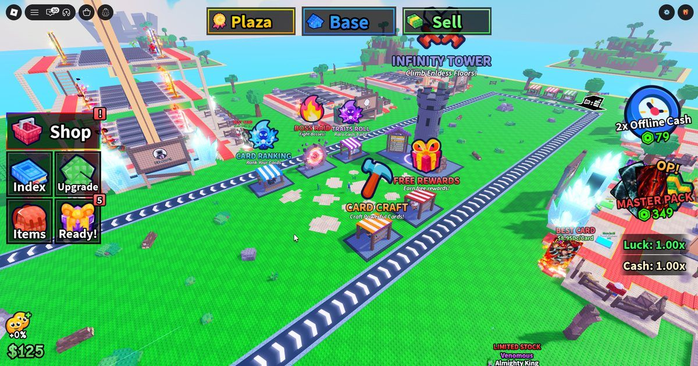

*Plaza from above: three stalls SHOP / SELL / UPGRADE plus six activity stations — CARD CRAFT, CARD RANKING (rank), BOSS RAID, TRAITS ROLL, INFINITY TOWER, FREE REWARDS (ads).*

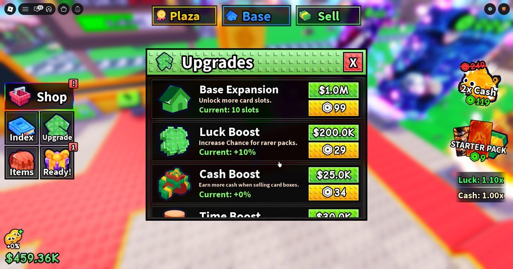

*The UPGRADE stall — 5 upgrades with dual pricing (Cash or Robux ⬡): Base Expansion (slots) · Luck Boost (+% rarer packs) · Cash Boost (+% on selling) · Time Boost (−% timer) · Speed Boost. The Cash price escalates steeply per level.*

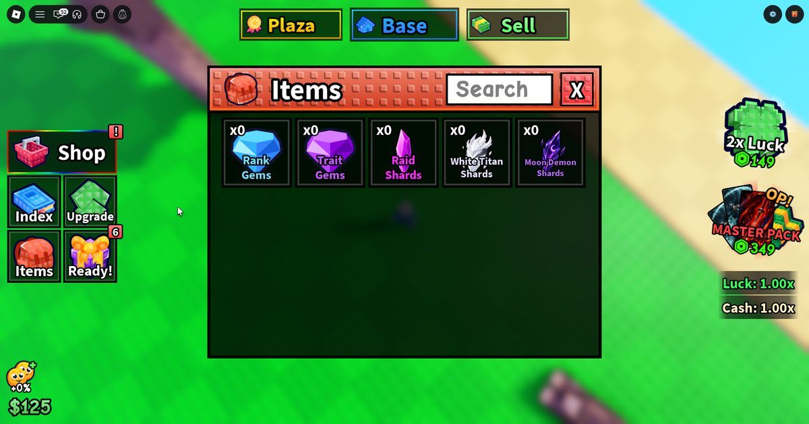

*The Items stall — 5 materials: Rank Gems (roll rank) · Trait Gems (roll trait) · Raid Shards (universal, from any boss) · White Titan Shards · Moon Demon Shards (boss-specific, feed boss-card crafts).*

![Potions — timed boosts. Cash I: "[2 Minutes] +10% Cash Boost", Use / Use(5x), stack cap 250. Three lines (Cash/Luck/Mutation) × three tiers (I–III).](images/020-potions-timed-boosts-cash-i-2-minutes-10-cash-bo.jpg)

*Potions — timed boosts. Cash I: "[2 Minutes] +10% Cash Boost", Use / Use(5x), stack cap 250. Three lines (Cash/Luck/Mutation) × three tiers (I–III).*

| Potion | Effect | Duration | Cap |

| --- | --- | --- | --- |

| Cash I / II / III | +10% / +20% / +35% Cash | 2 / 3 / 5 min | 250 / 125 / 75 |

| Luck I / III | +50% / +150% Luck Conveyor | 2 / 5 min | 250 / 75 |

| Mutation I / II | +5% / +8% Mutation Luck | 2 / 3 min | 200 / 100 |

Boosts **add into the HUD multiplier additively** (Cash 1.60x + a 35% potion = 1.95x), one potion per line at a time (a new tier replaces the old), up to three lines at once. Potion sources: Free Rewards (ads, 4/day), Tower rewards, the Robux shop.

## 07 The rolls: Rank & Trait

Two of a card's multipliers are rolled at separate gem-fueled roulette stations with pity. This is a second gacha layer — on top of the cards themselves.

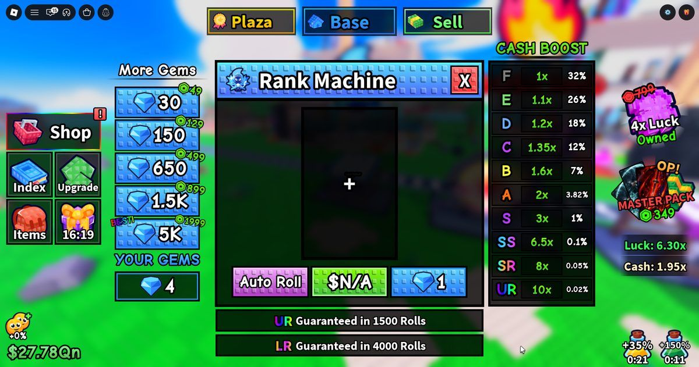

*Rank Machine (Card Ranking). Roll rank with Rank Gems (⬡1) or Cash. Rank is the card's Cash multiplier. Ladder: F 1x 32% · E 1.1x 26% · D 1.2x 18% · C 1.35x 12% · B 1.6x 7% · A 2x 3.82% · S 3x 1% · SS 6.5x 0.1% · SR 8x 0.05% · UR 10x 0.02% (+ LR).*

| Rank | ×Cash | Odds |

| --- | --- | --- |

| F | 1x | 32% |

| E | 1.1x | 26% |

| D | 1.2x | 18% |

| C | 1.35x | 12% |

| B | 1.6x | 7% |

| A | 2x | 3.82% |

| S | 3x | 1% |

| SS | 6.5x | 0.1% |

| SR | 8x | 0.05% |

| UR | 10x | 0.02% |

**Pity**: UR guaranteed in 1500 rolls, LR in 4000. Rolls are **RNG both ways** (you can slide back to F), and the Cash roll cost scales with card value ($3.83Qd to roll a $765.5T card). Rank Gems shop: 30=⬡49 · 150=⬡129 · 650=⬡499 · 1.5K=⬡899 · 5K=⬡1999.

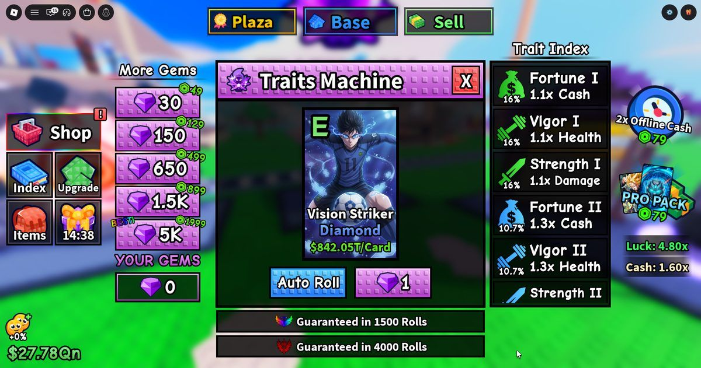

*Traits Machine (Traits Roll) — a mirror of the Rank Machine but with Trait Gems, pity 1500/4000. A trait is a card's second power multiplier: single-stat tiers (Fortune/Vigor/Strength) plus rare combo traits that buff Cash + Damage + HP at once.*

| Trait | Effect | Odds |

| --- | --- | --- |

| Fortune I / II | 1.1x / 1.3x Cash | 16% / 10.7% |

| Vigor I / II | 1.1x / 1.3x Health | 16% / 10.7% |

| Strength I / II | 1.1x / 1.3x Damage | 16% / ~10.7% |

| Berserk | 1.5x Damage + 1.5x Health | 1% |

| Tank | 1.2x Damage + 1.75x Health | 1% |

| Rich | 2x Cash | 0.4% |

| Emperor | 1.2x Cash + 1.5x Damage + 1.5x Health | 0.3% |

| Phoenix | 1.75x Cash + 1.75x Damage + 1.75x Health | 0.14% |

| Almighty | 2x Cash + 2x Damage + 2x Health | rarest |

Fortune buffs income; Vigor/Strength buff combat (Raid/Tower); the top combos (Emperor/Phoenix/Almighty) buff all three. Trait Gems come in bundles (30=⬡49 … 5K=⬡1999) or drip from the Tower and rewarded ads.

## 08 Card Craft evolution

The only non-gacha power lever: sacrifice several specific cards to get one far stronger. This is why a player keeps their "spare" cards.

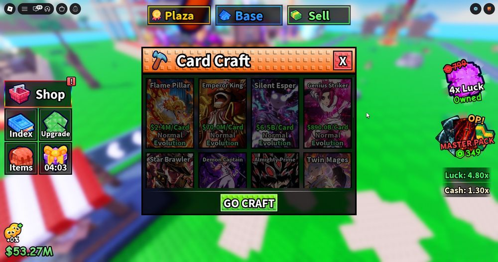

*Card Craft — a grid of 13 evolution recipes: Flame Pillar $2.4M · Emperor King $70M · Silent Esper $6.5B · Genius Striker $890B · … · Black Reaper $2.0O/Card (top recipe).*

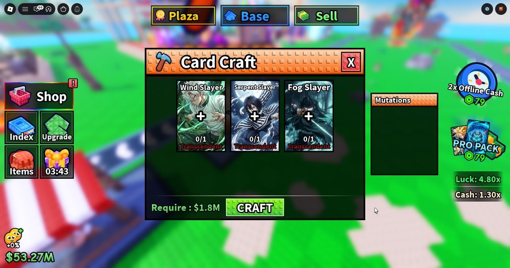

*Recipe detail: needs Wind Slayer + Serpent Slayer + Fog Slayer (all Transcendent, 1 each) + $1.8M and a Mutations slot → CRAFT.*

Craft = "pick a recipe, add the required cards, start it". You must **own** the exact ingredient cards (else "No available … card found"). A Mutations slot lets you force the evolved card's finish. Boss-specific shards (White Titan Shards — "used to craft the White Titan") are recipe inputs too. This is the main way to push the board up without gacha.

## 09 Combat: Boss Raid & Tower

Cards are not only income: they carry HP and DMG (from value + rank + trait), and two combat modes burn materials and drop new cards.

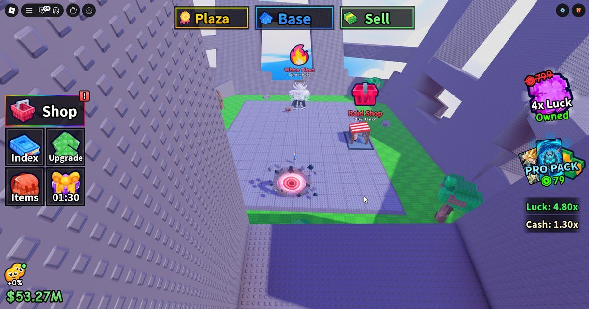

*Boss Raid: enter through the red portal at Plaza center → an arena. The boss (White Titan) opens on a ~30-min cycle, with a Raid Shop right in the arena. E Boss Fight when it is open.*

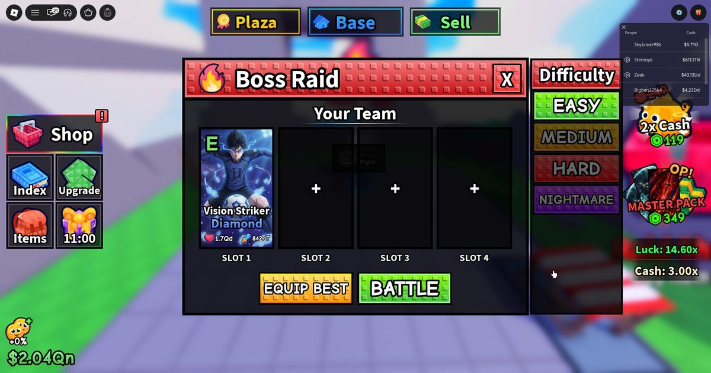

*Raid setup: a team of 4 cards + Equip Best, difficulty EASY / MEDIUM / HARD / NIGHTMARE. A card in combat = HP + DMG + Rank (Vision Striker: ❤1.7Qd / ⚔842.1T).*

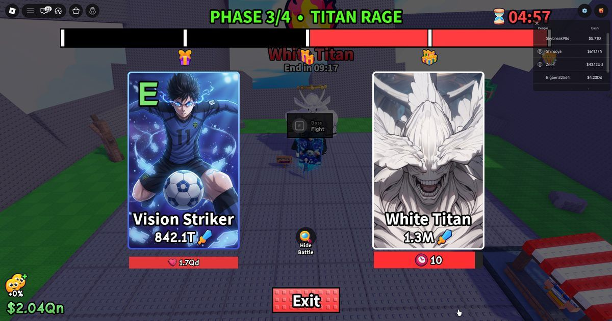

*The fight is 4 phases (segmented HP bar), ~5-min timer. Phase 3/4 = "TITAN RAGE": the boss enrages, damage jumps 261 → 1.3M. Recommended DMG/card by difficulty: Easy 1.3B · Medium 24.4Qn · Hard 4.7O (octillion); Nightmare higher still.*

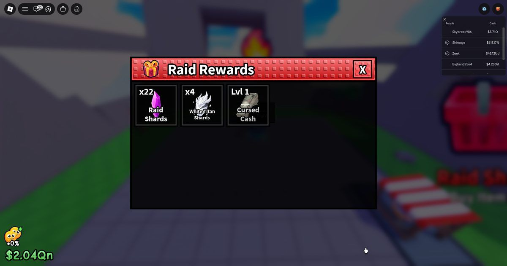

*Raid Rewards: x22 Raid Shards + x4 White Titan Shards + a "Cursed Cash" card (Lvl 1). Cooldown is 1 fight per hour. Raid Shop: White Titan card for 150 shards (=50% of your best card), Moon Demon for 175 (=60%).*

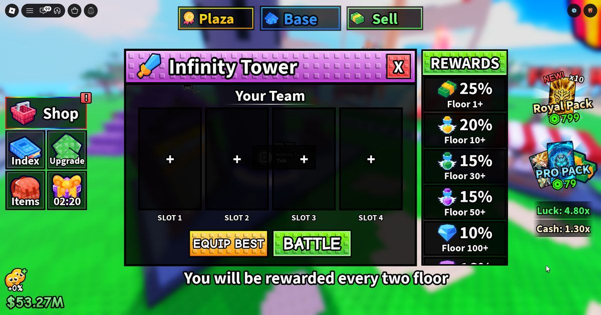

*Infinity Tower: a team of 4 cards → BATTLE. Rewards "every two floors" by milestone: Cash 25% Floor 1+ · potions · Rank Gems 10% Floor 100+ · Trait Gems 16% Floor 200+. The server leader sits at floor 963.*

*Tower gameplay is a 1v1 auto-battle: your DMG vs the enemy's HP (Fog Slayer 1.1B one-shots early floors). Enemy HP scales per floor; Auto Replay + Show/Hide Battle let you climb hands-free while walking your base. A 2x Tower Speed pass speeds the animation.*

## 10 Economy & prices

Cash is the soft currency from selling cards. The whole curve is exponential and effectively uncapped — which is exactly what creates demand for Robux accelerators.

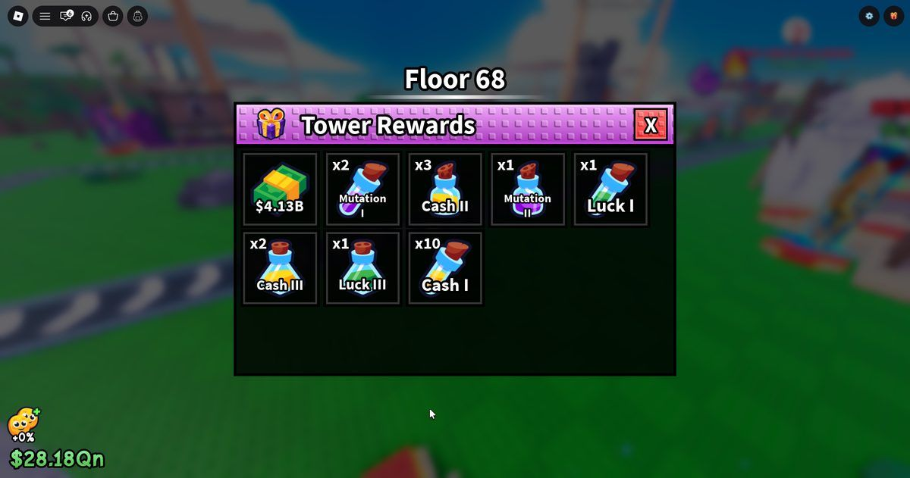

*Tower rewards for one climb (Floor 68) — the main free faucet of gems and potions: $4.13B + a pile of potions (Cash/Luck/Mutation I–III). This is where a player gets the consumables to roll with.*

| Where Cash goes | Mechanic | Scale on the capture |

| --- | --- | --- |

| Packs | Buy the next rarity tier | $100 → $1K → $1M → … → $100B |

| Card leveling | Level to 50 (×3300 on value) | Transcendent L1→2 = $80K |

| Upgrade Conveyor | "More luck" — no cap | $1K → $100K → $2.5M → … → $50T+ |

| Base Expansion | +1 slot, no cap | 21 slots $100T → 29 slots $8.0Qn |

| Rank/Trait rolls | Cash or gems | $3.83Qd to roll a pricey card |

Selling returns ~**50%** of value (Void Pack $2.0Qd → $1.0Qd), and that is the main Cash source at endgame — you sell rare packs/cards whole. Cash Boost (+200% max) and Time Boost (−24% max) **cap**, but Base Expansion and Luck Boost do not: they are what eats the exponential net worth.

**Honesty caveat.** The capture's leap to $Qn/$Sx is **not a solo pace**: a VIP player, D3adpo0139, repeatedly gifted the recorder expensive packs ("go sell it", "upgrade the conveyor"). The systems (pack tiers, sell prices, the conveyor sink) are real and frame-confirmed, but **that speed of wealth is not solo-reproducible**. The recorder even typed in chat: "I'll play myself, I'm missing a lot."

## 11 Monetization

The game sells three things: time (timer skips), chance (luck passes and gems), and direct outcome (packs and chase cards for Robux).

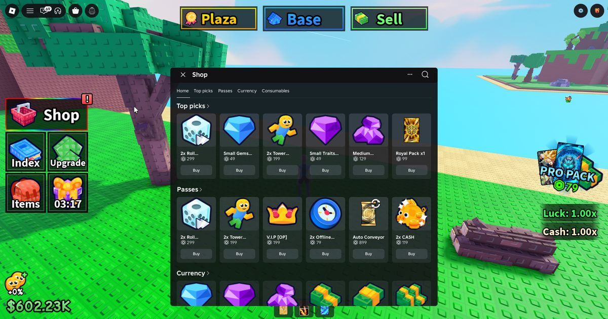

*The native Roblox store: tabs Home · Top picks · Passes · Currency · Consumables. Passes: 2x Roll ⬡299 · 2x Tower ⬡199 · V.I.P ⬡199 · 2x Offline ⬡79 · Auto Conveyor ⬡899 · 2x CASH ⬡119. The ⬡ prices match the API 1:1.*

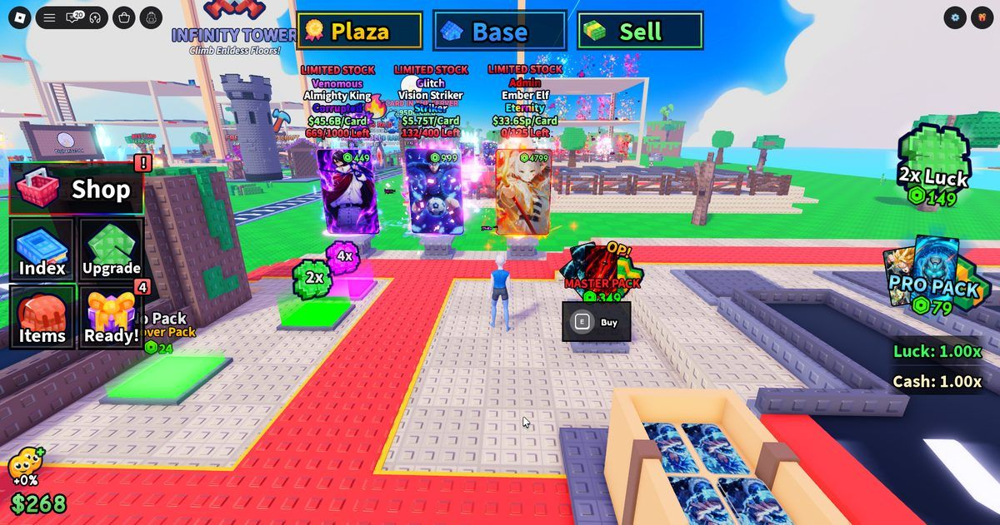

*Podiums of Robux chase cards on limited stock: Venomous Almighty King $45.6B/Card ⬡449 (669/1000) · Glitch Vision Striker $5.75T/Card ⬡999 · Admin Ember Elf $33.6Sp/Card ⬡4799 (0/125 — sold out). Buy the dream directly.*

| Category | Products (Robux ⬡) |

| --- | --- |

| Packs | Starter ⬡9 · Pro ⬡79 · Master ⬡349 · Royal ⬡799 · any conveyor pack directly |

| Luck passes | Super Luck 2x ⬡149 · Ultra Luck 4x ⬡799 (multiplicative, they stack) |

| Cash passes | 2x Cash ⬡119 · 2x Offline Cash ⬡79 |

| Roll/battle speed | 2x Roll ⬡299 · 2x Tower ⬡199 · 2x Tower Speed ⬡199 |

| Automation | Auto Conveyor ⬡899 · V.I.P ⬡199 (−20% timer + 1.5x Cash + Name Tag) |

| Timer skips | Skip 5/10/30/120min · Skip All ⬡199–599 |

| Direct cash | Small +$50K ⬡9 · Simple +$300K ⬡24 · Medium +$2M ⬡49 · Large +$10M ⬡129 · +$250M ⬡399 |

| Gems/potions | Rank/Trait Gems (30=⬡49 … 5K=⬡1999) · potions · Recover Pack ⬡24 |

The hook mechanic is the **time wall**: higher packs open over 30 min – 1h+, and the endgame base holds **8+ packs at once**. Hours of queued waiting is exactly what makes Skip All (⬡199–599) worth it. Finishes and limited chase-card stock stack FOMO on top of time.

## 12 HUD & menus

The HUD serves the loop: top is three places (Plaza/Base/Sell), left is four menus, bottom is the multipliers and a card hotbar.

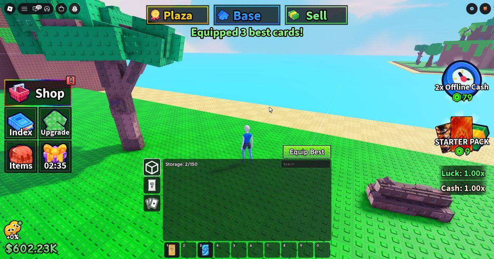

*The cards panel: Storage 2/150, an Equip Best button ("Equipped 3 best cards!") that auto-fills the base slots with your highest-value cards; a 10-slot hotbar (keys 1–0) for quick placement.*

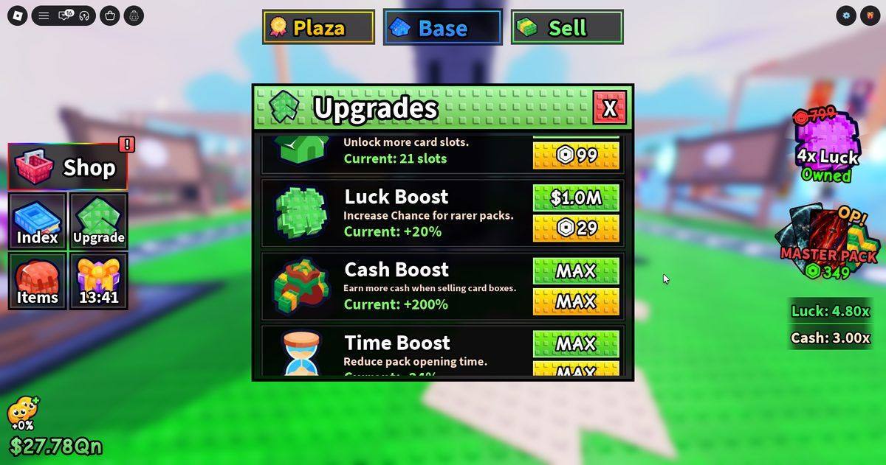

*The Upgrades panel with its caps: Cash Boost +200% MAX (→ Cash 3.00x), Time Boost −24% MAX; right side is the persistent HUD Luck 14.60x / Cash 3.00x — the sum of upgrades + passes + gems + potions.*

The right rail always shows the current **Luck/Cash ×** and offer pads; the "Ready!" button doubles as the PlayTime-reward timer. Everything a player does reads as those two numbers going up.

## 13 Retention

Four overlaid return loops — daily, per-session, ad-based and social — plus live events and player-to-player gifts.

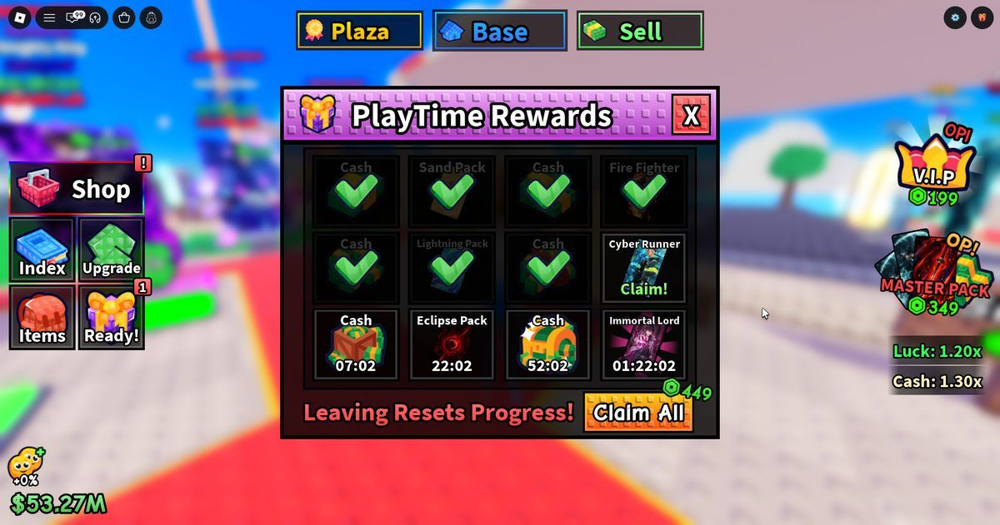

*PlayTime Rewards — a session ladder of 12 rewards (cash/packs/cards) that resets when you leave ("Leaving Resets Progress!"). Claim All for ⬡449 monetizes impatience.*

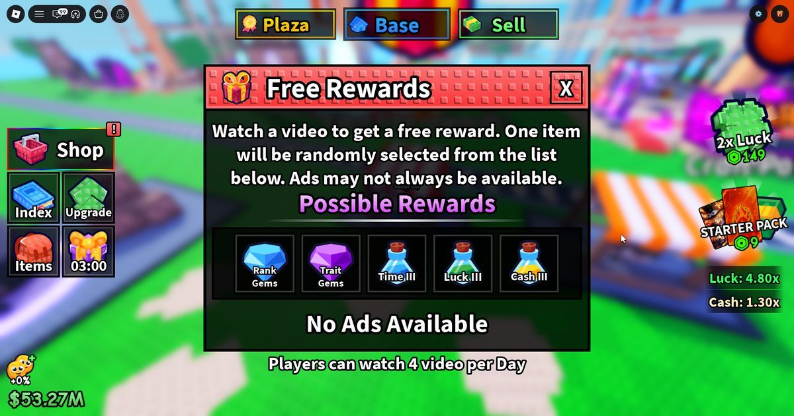

*Free Rewards — a rewarded ad: 4 videos/day, a random drop from Rank Gems / Trait Gems / Time III / Luck III / Cash III potions. An F2P trickle of gems and consumables.*

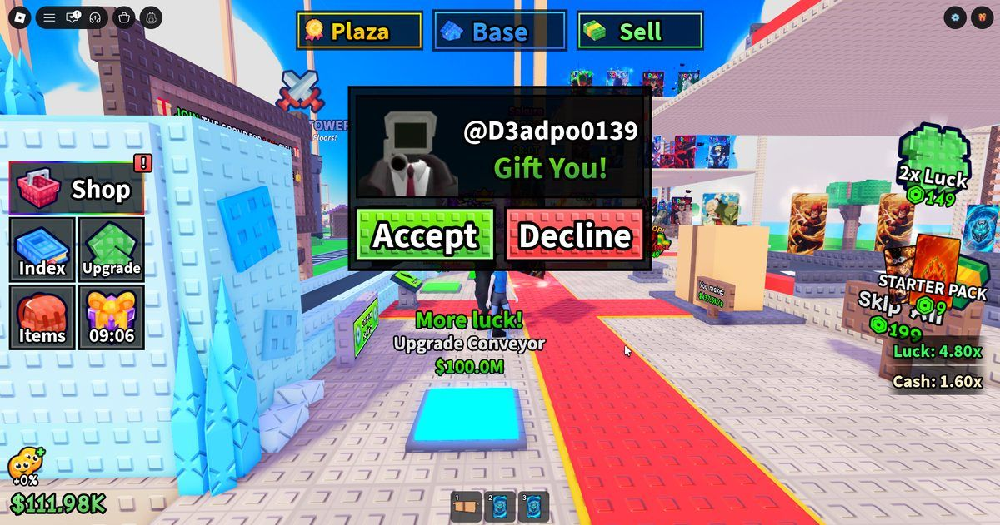

*Player gifting: another player sends an "@player Gift You!" popup with Accept/Decline. This is the trade channel; Settings has a "Block Gift request" toggle (default NO).*

| Loop | What it gives | Hook |

| --- | --- | --- |

| Offline earnings | "Welcome Back!" — accrued while away (e.g. $934.78Qd) | double for ⬡29 + 2x Offline pass ⬡79 |

| Daily Rewards | 7 days: cash + chase packs/cards | 24h cooldown, escalating rewards |

| PlayTime | 12 rewards by time in session | resets on leave → stay longer |

| Free Rewards | ads: gems + potions | 4/day — come back tomorrow |

| Social goal | like goal 100K → "BIG UPDATE" | collective unlock |

| Group | +1.25x Cash for joining | permanent bonus for a follow |

| Events | "Join Event" Sat 6PM — Big Update | scheduled content drop |

A separate hit is **offline earnings**: on return a **"Welcome Back! You have earned: $X"** popup appears (seen: $934.78Qd) — the base farms income while you're away. Right there is a **"Would you like to double it?" → YES for ⬡29** (double the reward for Robux), and the **2x Offline Cash ⬡79** pass doubles the base accrual. Two monetization layers on one return screen.

## 14 Badges & the social funnel

The game ships no classic Roblox badges — their role is played by a collective social funnel and public leaderboards.

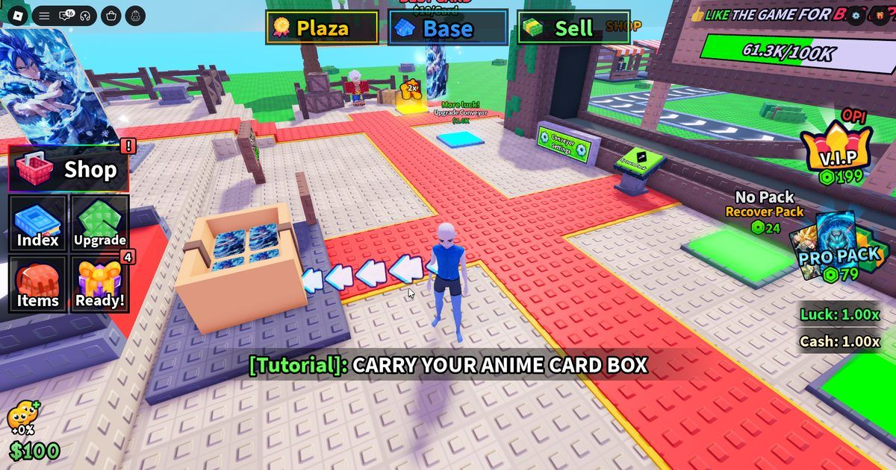

*In place of achievement badges are collective goals: a "LIKE THE GAME FOR BIG UPDATE" board with a like counter 61.3K/100K and "JOIN THE GROUP FOR 1.25x CASH". Social actions convert into an in-game bonus and update pressure.*

Plus two public leaderboards (Cash net worth and Tower floor, see Passport) — that is the status system. badges.json is formally empty: the funnel here is not "collect N badges" but "push a number higher than your neighbor".

## 15 SFX, VFX & ceremonies

The open ceremony is the emotional core of gacha. The game turns every card into a small full-screen moment, and rarity reads instantly by color and shine.

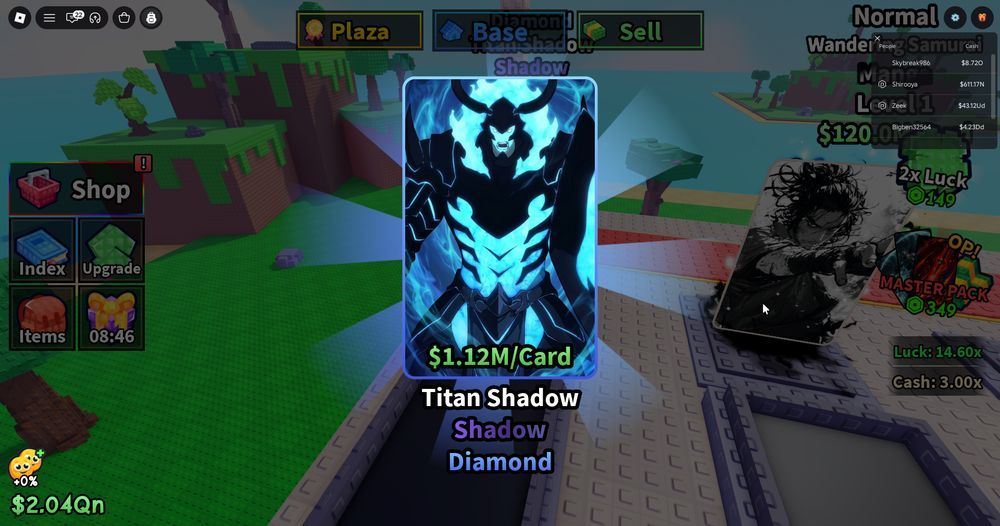

*The full-screen pack open: the card art fills the screen with $/Card + Rarity + Finish (Titan Shadow — Shadow — Diamond).*

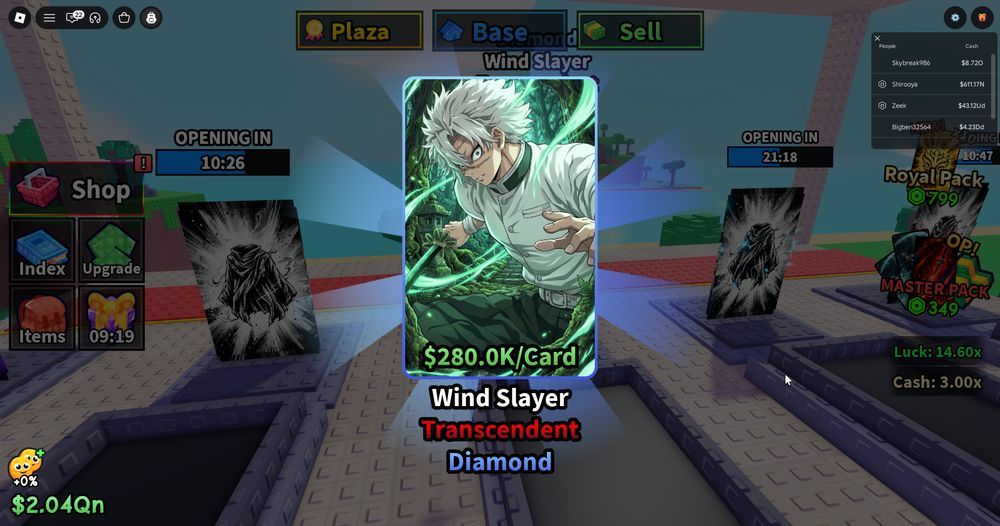

*Each finish gets its own color and glow (Wind Slayer — Transcendent — Diamond). Rarity reads instantly from the frame and shine.*

Settings expose separate **Pack Reveal Effect** and **Visual Effects** toggles — the reveal and effects are surfaced as options because they are the game's "juice". In combat the **TITAN RAGE** phase gets its own ceremony (the boss enrages), and leveled cards wear a **MAX Level 50** badge.

## 16 Clippable moments

Thumbnails of the most-viewed videos about the game.

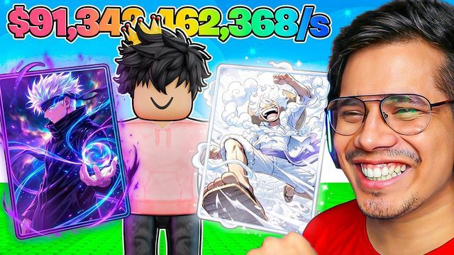

*436,410 viewsANIME CARD FARMING ROBLOX 😱 GamerBlox*

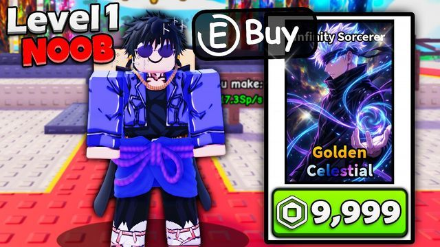

*52,993 viewsStarting as Noob with OP CARD in Anime Card Farm Roblox! NagRoblox*

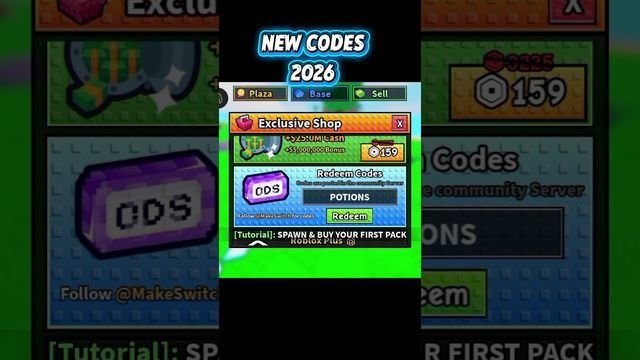

*35,683 views*UPDATE CODES* ALL WORKING CODES FOR ANIME CARD FARM IN JUNE 2026 ROBLOX ANIME CARD FARM CODES Codes Zone Gaming*

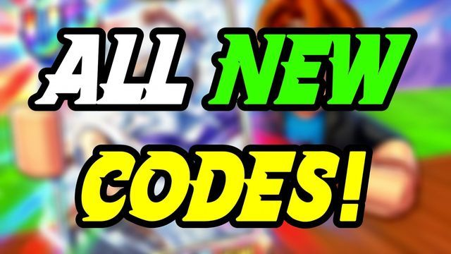

*11,768 views*NEW* all WORKING CODES in Anime Card Farm IN 2026! Beastly.Roblox*

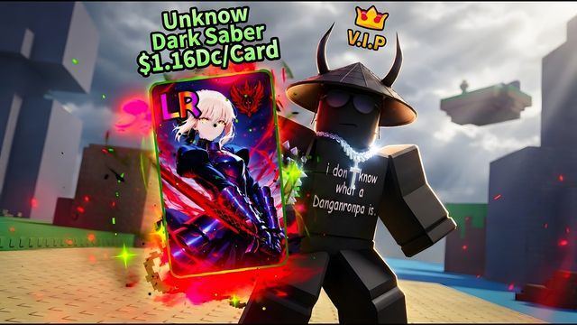

*11,144 viewsThe NEW fastest way to become OP in Anime Card Farm StarkiIIer*

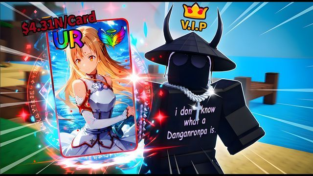

*7,836 viewsHOW TO BECOME OP FAST IN ANIME CARD FARM StarkiIIer*

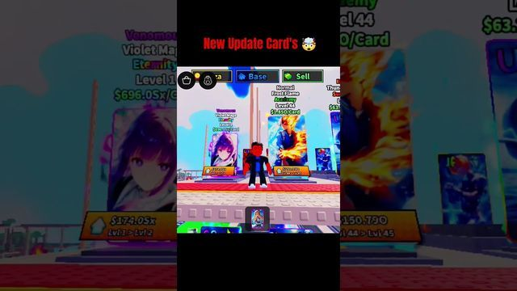

*6,265 viewsNew Update Anime Card Farm 🤯 Roblox NaveenCombat*

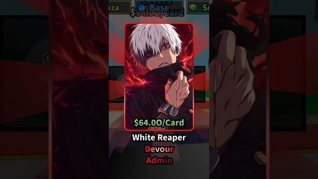

*5,917 views🔥 I Found the RAREST Card in the BIG UPDATE! 😱 | Anime Card Farm Roblox bagaskara*

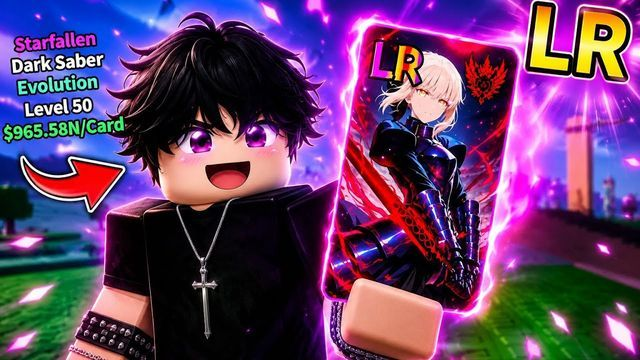

*5,682 views🔥 How to Get Craft Powerful Cards in Anime Card Farm Roblox! Complete Crafting Guide (2026) bagaskara*

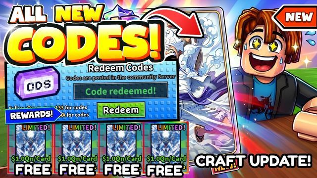

*5,394 views*🔨CRAFT UPDATE* ALL WORKING CODES FOR ANIME CARD FARM IN JULY 2026! ROBLOX ANIME CARD FARM EdgedSwordHD*

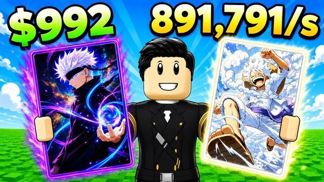

*5,012 viewsSTRONGEST Anime Card in anime card Farm in Roblox! ⚔️💰 RJ Blox*

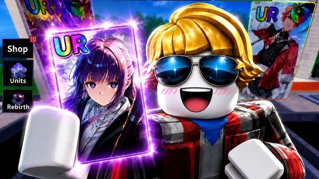

*4,581 views🔥 Anime Card Farm Roblox RAID Gameplay | Quick Way to Farm Mythic, Secret & Rare Cards (Full Guide) bagaskara*

## 17 Updates × online (CCU)

Daily online over the window; vertical markers are update dates. Expand a card to see exactly WHAT changed (SKUs and prices old→new). The correlation is descriptive, not causal.

online (CCU)

major content (≥5 SKUs)

content

prices only

100 1.0K 10.0K 5/25 6/5 6/16 6/27 7/8 7/19 7/30

### Updates and their internals

31.05

· launch: packs

CCU 7d 33→102 (+208%)

added 2: packs ×2 · storefront edit (name/description)

**update contents**

Added:

· Soccer Pack

· Void Pack

06.06

· launch: packs

CCU 7d 97→270 (+178%)

added 4: packs ×2 · other ×2 · prices: 0↑ / 2↓ · storefront edit (name)

**update contents**

Added:

· Empyrean Pack

· Bizarre Pack

· Skip <240MIN!

· 2x Tower Speed [NEW]

Prices:

· Phantom Monarch [LIMITED STOCK]:

1999→1499⬡ ↓

· Pirate King [LIMITED STOCK]:

599→499⬡ ↓

07.06

· launch

CCU 7d 100→382 (+282%)

added 1: other ×1

**update contents**

Added:

· Skip <360MIN!

08.06

· launch: packs

CCU 7d 103→500 (+385%)

added 1: packs ×1

**update contents**

Added:

· Skip All Packs Timers!

11.06

· launch: packs

CCU 7d 206→1382 (+571%)

added 7: packs ×5 · other ×2

**update contents**

Added:

· 16x Server Luck (+5 min)

· 16x Server Luck [Extra 5 min]

· Small Traits Gems Pack

· Medium Traits Gems Pack

· Large Traits Gems Pack

· Huge Traits Gems Pack

· Mega Traits Gems Pack

13.06

· launch: packs

CCU 7d 237→2266 (+856%)

added 3: packs ×2 · other ×1 · storefront edit (name)

**update contents**

Added:

· Titan Pack

· Evolved Pack

· 2x Roll Speed [NEW]

22.06

· launch

CCU 7d 5148→7170 (+39%)

added 2: other ×2 · prices: 1↑ / 0↓

**update contents**

Added:

· X4 Offline Reward!

· Temple Guardian [LIMITED]

Prices:

· Curse King [LIMITED STOCK]:

449→799⬡ ↑

01.07

· launch: packs

CCU 7d 6990→12233 (+75%)

added 4: packs ×4 · prices: 0↑ / 1↓

**update contents**

Added:

· Ruin Pack

· Chaos Pack

· Oni Pack

· Grimoire Pack

Prices:

· Curse King [LIMITED STOCK]:

799→499⬡ ↓

05.07

· launch: packs

CCU 7d 11401→16246 (+42%)

added 9: packs ×6 · other ×3 · prices: 0↑ / 1↓ · storefront edit (name)

**update contents**

Added:

· Abyss Lord [LIMITED STOCK]

· Diamond Pack x10 [25% OFF]

· Diamond Pack x3

· Diamond Pack x1

· Titan Ravager [LIMITED STOCK]

· Mage Pack

· Beast Pack

· Viking Pack

· Auto Conveyor

Prices:

· Infinity Sorcerer [LIMITED STOCK]:

1499→999⬡ ↓

## 18 What to take

The transferable design moves — the reason we tear other games apart.

1

#### A cozy mask on whale math

The "card factory" and ASMR open lower the barrier to entry, but underneath is a 5-multiplier gacha machine. Soft wrapper + hard math = a wide funnel and a deep spending ceiling.

2

#### Five independent multipliers on one object

A card = name×rarity × finish × level × rank × trait. Each multiplier is its own system and its own monetization point; together they yield a thousandfold spread from a single entity.

3

#### Level as the dominant lever

Leveling to MAX 50 = ×3300 on value — reliably, across every card. One clear-but-huge lever keeps a player in the "pull → level → re-place" loop longer than the gacha itself does.

4

#### A time wall sold in pieces

Pack timers grow with rarity (5 min → 1h+), and the base holds 8+ queues. Hours of waiting convert into Skip 5/10/30/120min and Skip All — time is sold in graded doses.

5

#### Layered return loops

Daily (24h) + PlayTime (session, resets on leave) + Free Rewards (ads, 4/day) + a social like goal — four different reasons to come back that do not step on each other.

6

#### Honesty in the teardown

The capture's endgame wealth was partly gifted by a VIP player. We describe the systems as real but never sell the gifted speed as a solo pace — otherwise the reconstruction lies about balance.
